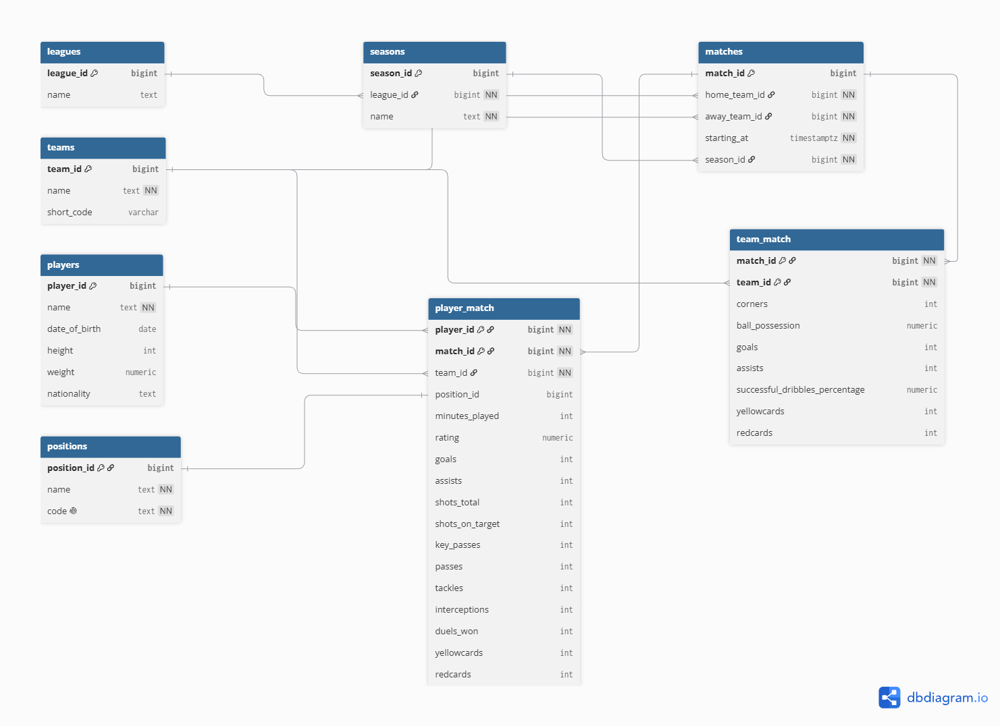

# Football Analytics — Scottish Premiership 2025/26

Аналитический проект по сезону 2025/26 шотландской Премьер-лиги.

В проекте собран полный цикл работы с футбольными данными: получение статистики через API, подготовка и загрузка данных в PostgreSQL, SQL-анализ, исследование данных в Python и создание интерактивного отчёта в Power BI.

Основная часть проекта посвящена анализу команд и игроков: результатам матчей, игровым показателям, различиям между домашними и гостевыми встречами и взаимосвязям между статистикой и результатами.

## О проекте

В работе использованы данные Scottish Premiership за сезон 2025/26. Датасет включает 228 матчей, 12 команд и 439 игроков.

Для анализа собраны данные о результатах матчей, командной статистике и индивидуальных действиях игроков. На их основе исследуются выступления команд в сезоне и игровые профили футболистов.

Проект включает несколько уровней анализа: от результатов отдельных матчей и итоговых показателей команд до сравнения игроков с учётом их позиции и игрового времени.

## Получение и подготовка данных

Исходные данные получены через Sportmonks API — сервис, предоставляющий данные о футбольных соревнованиях, матчах, командах и игроках. Для каждого матча сезона загружалась не только основная информация, но и статистика команд и составы игроков.

После получения данные были проверены и подготовлены для дальнейшей работы. Проверялись количество матчей и команд, уникальность матчей, соответствие сезона, наличие участников матча и корректность связей между командами и игроками.

Подготовленные данные загружены в PostgreSQL, где сформирована реляционная структура для дальнейшего SQL-анализа.

## PostgreSQL

Для хранения и анализа данных создана реляционная база данных в PostgreSQL. Структура разделяет справочную информацию о лигах, сезонах, командах, игроках и позициях и данные, связанные с конкретными матчами.

В базе используются следующие основные таблицы:

- `leagues` — информация о лигах;
- `seasons` — сезоны и их связь с лигами;
- `teams` — команды;
- `players` — игроки и их основные характеристики;
- `positions` — игровые позиции;
- `matches` — информация о матчах;
- `team_match` — статистика команды в конкретном матче;
- `player_match` — статистика игрока в конкретном матче.

Отдельное хранение матчей, командной и индивидуальной статистики позволяет сохранить разные уровни данных. Например, один матч связан с двумя записями в `team_match`, по одной для каждой команды, а `player_match` содержит выступления отдельных игроков в этих матчах.

Связи между таблицами построены с помощью первичных и внешних ключей. Это позволяет объединять данные на разных уровнях — от конкретного матча до сезона, команды или отдельного игрока — и использовать их для последующего SQL-анализа.

### ER-диаграмма

На диаграмме показана структура базы данных и связи между основными сущностями проекта.



*Рисунок 1 — ER-диаграмма базы данных PostgreSQL*

## SQL-анализ

После загрузки данных в PostgreSQL следующий этап был посвящён подготовке данных для аналитики. На этом уровне результаты матчей, командная статистика и выступления игроков объединялись в единые наборы данных, с которыми уже можно было сравнивать команды и футболистов между собой.

Отдельное внимание уделялось расчёту показателей, которые нельзя получить напрямую из одной исходной таблицы: результата матча, разницы голов, набранных очков, соперника и контекста домашней или гостевой игры.

Для дальнейшей работы были созданы три представления:

- `match_analysis` — данные о матчах и их результатах;
- `team_match_analysis` — показатели команд в отдельных матчах;
- `player_match_analysis` — показатели игроков с контекстом матча, команды и соперника.

Например, в `team_match_analysis` статистика команды сопоставляется со статистикой её соперника в рамках одного матча:

```sql
JOIN team_match AS opponent_tm
    ON opponent_tm.match_id = t_m.match_id
    AND opponent_tm.team_id != t_m.team_id
```

Это позволяет для каждой команды получить данные о сопернике и на их основе рассчитать разницу голов, результат матча и набранные очки.

Эти представления стали основой для последующего анализа в Python и визуализации в Power BI.

## Аналитический анализ

Подготовленные данные были исследованы в Python с использованием Pandas и библиотек визуализации.

Анализ проводился на двух уровнях. Сначала рассматривался сезон в целом и выступления команд: результаты матчей, набранные очки, атакующие и оборонительные показатели, различия между домашними и гостевыми играми и связь игровых показателей с результатами.

Отдельный блок посвящён игрокам. Футболисты сравнивались по основным показателям результативности, созданию моментов, передачам и защитным действиям с учётом игровой позиции и проведённого на поле времени.

Важной частью анализа стало не только построение показателей и визуализаций, но и проверка полученных наблюдений. Это позволило отделить непосредственно наблюдаемые закономерности в данных от их возможной интерпретации.

### Анализ команд

Одним из наиболее заметных результатов стало выраженное преимущество домашних матчей. Для большинства команд на своём поле одновременно наблюдались более высокая результативность, большее количество набранных очков и меньшее число пропущенных голов. При этом сила домашнего преимущества существенно различалась между командами: например, у Hearts среднее количество очков за домашний матч составляло 2,58 против 1,63 в гостях, тогда как у Falkirk показатели были практически одинаковыми — 1,30 и 1,28.


*Среднее количество набранных очков дома и в гостях по командам.*

Также были исследованы различия в игровых стилях команд. Команды с похожей результативностью могли существенно отличаться по оборонительным показателям. Например, Aberdeen и Livingston забивали в среднем одинаковое количество голов за матч, но Livingston пропускал значительно больше.

Отдельно проверялась связь игровых показателей с результатами команд. Владение мячом оказалось наиболее заметно связано с набранными очками среди рассмотренных показателей, однако само по себе это наблюдение не позволяет говорить о владении как об отдельном факторе успеха. Для угловых и обводок подобной устойчивой связи с результатами не обнаружено.


*Связь среднего владения мячом с набранными очками команд.*


### Анализ игроков

Игроки сравнивались с учётом их игровой позиции и проведённого на поле времени. Для сопоставления футболистов с разным количеством игрового времени использовались показатели в расчёте на 90 минут.

Анализ показал, что отдельные игровые характеристики описывают разные стороны профиля футболиста. У полузащитников, например, атакующая активность имела положительную связь с использованием дриблинга, тогда как связь с оборонительной активностью была отрицательной. Это показывает, что даже внутри одной позиции игроки могут иметь заметно различающиеся игровые профили.


*Распределение полузащитников по показателям атакующей и оборонительной активности.*

Для более детального сравнения отдельных игровых профилей были использованы нормированные показатели передачи, дриблинга, атаки и обороны.


*Сравнение игровых профилей выбранных полузащитников.*

У нападающих наиболее тесно были связаны показатели ударов, ударов в створ и голов за 90 минут. При этом ассисты и созданные моменты в большей степени характеризовали отдельное направление атакующей активности.

Таким образом, анализ игроков показывает, что сравнение футболистов только по одной итоговой метрике может скрывать существенные различия в характере их вклада в игру.

Полный анализ с расчётами и визуализациями представлен в Jupyter Notebook.

## Power BI

На основе данных PostgreSQL был создан интерактивный отчёт в Power BI. В отчёт загружены данные исходных таблиц базы данных, после чего в Power BI была сформирована модель данных со связями между таблицами.

Отчёт состоит из трёх основных страниц. `Season Overview` показывает общую картину чемпионата: турнирную таблицу, основные показатели сезона и результаты матчей. `Team Overview` позволяет выбрать команду и исследовать её результаты, текущую форму и различия между домашними и гостевыми матчами. `Player Overview` предназначена для анализа отдельных футболистов: доступны их основные показатели, игровые профили и изменение рейтинга по ходу сезона.

Интерактивные фильтры позволяют переходить от общей картины чемпионата к отдельной команде или игроку и исследовать данные в нужном срезе.


*Общая статистика сезона и турнирная таблица.*


*Анализ результатов и показателей выбранной команды.*


*Анализ статистики и игрового профиля выбранного игрока.*

## Используемые технологии

- PostgreSQL
- SQL
- Python
- Pandas
- Matplotlib
- SciPy
- Jupyter Notebook
- Power BI
- Sportmonks API